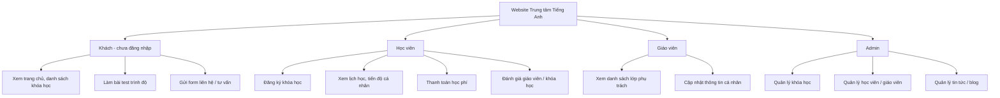
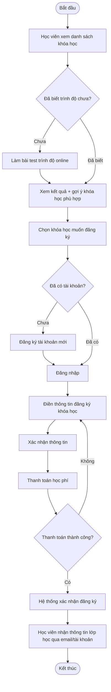
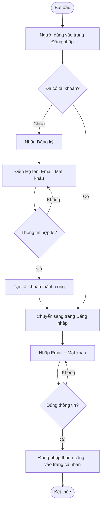
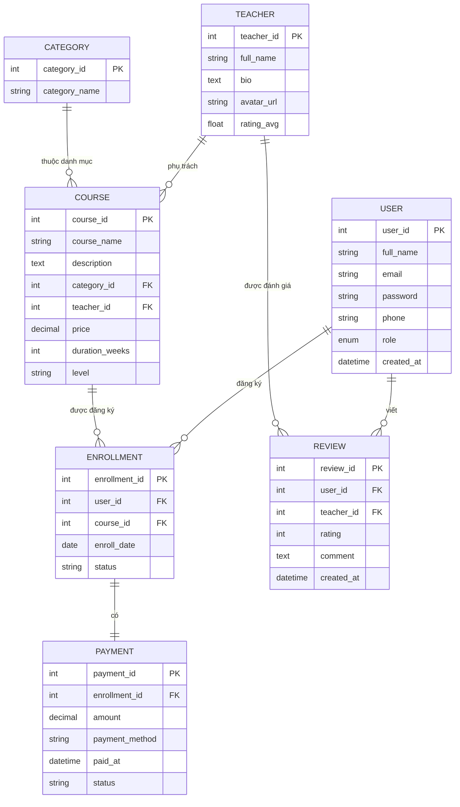

# 📚 ĐỒ ÁN: Website Trung Tâm Tiếng Anh (Front-end)

> Nhóm thực hiện: **Bạn** + **Hoàng**
> Cách dùng: Mở Notion → New Page → nút `⋯` (Import) → chọn file này, hoặc copy toàn bộ nội dung dán vào 1 trang trống. Notion sẽ tự nhận heading, bảng, checkbox.

---

## 🗺️ Mục lục

- [Phần 0: Tổng quan tiến độ (Overall Progress)](#phần-0-tổng-quan-tiến-độ)
- [Phần 1: Xác định vấn đề (Problem Statement)](#phần-1-xác-định-vấn-đề-problem-statement)
- [Phần 2: Nghiên cứu (Research)](#phần-2-nghiên-cứu-research)
- [Phần 3: Sơ đồ thiết kế hệ thống](#phần-3-sơ-đồ-thiết-kế-hệ-thống)
- [Phần 4: Schedule phân công nhóm](#phần-4-schedule-phân-công-nhóm)

---

# 📊 TỔNG QUAN TIẾN ĐỘ (OVERALL PROGRESS)

> ⚠️ Đây là bảng **template sống** — 2 bạn cần tự cập nhật % và trạng thái mỗi tuần (không tự động tính, chỉ đổi số bằng tay). Số liệu bên dưới là **hiện trạng tại thời điểm này** (mới xong phần tài liệu/thiết kế, chưa code), bạn chỉnh lại khi có tiến độ mới.

---

## 🎯 Tiến độ tổng thể dự án

**Tổng tiến độ: 21% (6/29 task hoàn thành)**

```
[████░░░░░░░░░░░░░░░░] 21%
```

| Giai đoạn | % hoàn thành | Trạng thái |
|---|---|---|
| 1. Problem Statement | 100% | ✅ Hoàn thành |
| 2. Research | 100% | ✅ Hoàn thành |
| 3. Requirements + Tech stack | 30% | 🔵 Đang làm (chưa chốt tech stack) |
| 4. Sơ đồ thiết kế (User tree, Activity, ERD) | 100% | ✅ Hoàn thành |
| 5. Wireframe/Figma | 0% | ⬜ Chưa bắt đầu |
| 6. Code giao diện (9 trang) | 0% | ⬜ Chưa bắt đầu |
| 7. Ghép nối & kiểm thử | 0% | ⬜ Chưa bắt đầu |
| 8. Báo cáo & Slide | 0% | ⬜ Chưa bắt đầu |

---

## 👤 Tiến độ theo từng người

| Người | Số task được giao | Số task đã xong | % hoàn thành |
|---|---|---|---|
| **Duy** (bạn) | 12 | 5 | **≈ 42%** |
| **Hoàng** | 10 | 2 | **≈ 20%** |
| Cả 2 (task chung) | 7 | 0 | 0% |

```
Duy    [████████░░░░░░░░░░░░] 42%
Hoàng  [████░░░░░░░░░░░░░░░░] 20%
```

> 💡 Duy đang tạm nhỉnh hơn vì các task tài liệu/thiết kế nền tảng (Problem Statement, ERD, Activity Diagram...) đã hoàn thành. Hoàng sẽ tăng nhanh khi bước vào giai đoạn code (Tuần 4-5) vì được giao 4 trang giao diện + phần kiểm thử responsive.

---

## 📋 Chi tiết từng task (đối chiếu với Schedule)

| # | Task | Người phụ trách | Trạng thái | % |
|---|---|---|---|---|
| 1 | Problem Statement | Duy | ✅ Xong | 100% |
| 2 | Research 2 web tham khảo | Hoàng | ✅ Xong | 100% |
| 3 | Research + tính năng mới | Duy | ✅ Xong | 100% |
| 4 | Họp chốt vấn đề + tính năng | Cả 2 | ⬜ Chưa họp | 0% |
| 5 | Requirements (Functional/Security/UI/Perf) | Hoàng | 🔵 Đang làm | 30% |
| 6 | Chốt tech stack | Duy | ⬜ Chưa chốt | 0% |
| 7 | User Tree | Duy | ✅ Xong | 100% |
| 8 | Activity Diagram | Hoàng | ✅ Xong | 100% |
| 9 | ERD | Duy | ✅ Xong | 100% |
| 10 | Chuẩn hóa dữ liệu | Duy | ✅ Xong | 100% |
| 11 | Wireframe/Figma | Hoàng | ⬜ Chưa bắt đầu | 0% |
| 12 | Style guide chung | Cả 2 | ⬜ Chưa bắt đầu | 0% |
| 13 | Trang chủ | Duy | ⬜ Chưa bắt đầu | 0% |
| 14 | Trang danh sách khóa học | Duy | ⬜ Chưa bắt đầu | 0% |
| 15 | Trang chi tiết khóa học | Hoàng | ⬜ Chưa bắt đầu | 0% |
| 16 | Trang Đăng nhập/Đăng ký | Hoàng | ⬜ Chưa bắt đầu | 0% |
| 17 | Trang cá nhân học viên | Duy | ⬜ Chưa bắt đầu | 0% |
| 18 | Trang giáo viên | Hoàng | ⬜ Chưa bắt đầu | 0% |
| 19 | Trang Blog | Duy | ⬜ Chưa bắt đầu | 0% |
| 20 | Trang Liên hệ | Hoàng | ⬜ Chưa bắt đầu | 0% |
| 21 | Header/Footer/Navbar | Cả 2 | ⬜ Chưa bắt đầu | 0% |
| 22 | Ghép project | Cả 2 | ⬜ Chưa bắt đầu | 0% |
| 23 | Kiểm tra responsive | Hoàng | ⬜ Chưa bắt đầu | 0% |
| 24 | Kiểm tra end-to-end | Duy | ⬜ Chưa bắt đầu | 0% |
| 25 | Fix bug, tối ưu | Cả 2 | ⬜ Chưa bắt đầu | 0% |
| 26 | Báo cáo Phân tích-Thiết kế | Duy | ⬜ Chưa bắt đầu | 0% |
| 27 | Báo cáo Công nghệ-Triển khai | Hoàng | ⬜ Chưa bắt đầu | 0% |
| 28 | Slide thuyết trình | Cả 2 | ⬜ Chưa bắt đầu | 0% |
| 29 | Tập thuyết trình | Cả 2 | ⬜ Chưa bắt đầu | 0% |

---

## 🔄 Cách cập nhật mỗi tuần

1. Sau mỗi buổi họp nhóm, đổi cột **Trạng thái** và **%** của các task đã làm
2. Cộng lại số task ✅ / tổng 29 task → cập nhật lại **% tổng thể** ở đầu trang
3. Cộng riêng task của Duy và Hoàng → cập nhật lại % theo từng người
4. Nếu dùng Notion: có thể tạo cột "Progress" dạng %, Notion sẽ tự vẽ progress bar đẹp hơn thay vì gõ tay `████░░░`


---

# 📝 XÁC ĐỊNH VẤN ĐỀ (PROBLEM STATEMENT)
### Đồ án: Website Front-end Trung tâm Tiếng Anh

---

## 1. Bối cảnh

Tại Việt Nam, các trung tâm Anh ngữ hiện nay đã đầu tư khá mạnh vào website (ILA, Wall Street English, Apax Leaders...), nhưng phần lớn website của các trung tâm **quy mô vừa và nhỏ** vẫn còn dừng ở mức "trang giới thiệu tĩnh": chỉ có thông tin khóa học, số điện thoại liên hệ, và một form đăng ký tư vấn đơn giản. Toàn bộ quy trình sau đó — tư vấn, xếp lớp, đăng ký, theo dõi lịch học — vẫn xử lý thủ công qua điện thoại/Zalo/Facebook.

Trong khi đó, học viên ngày nay có xu hướng muốn **tự tìm hiểu, tự kiểm tra trình độ, tự đăng ký online** trước khi quyết định đến trung tâm, tương tự cách các hệ thống lớn (ILA, Wall Street English) đang vận hành.

## 2. Vấn đề cụ thể

Từ khảo sát thực tế và trải nghiệm cá nhân, nhóm nhận thấy các vấn đề sau ở nhiều website trung tâm tiếng Anh quy mô vừa/nhỏ:

**Vấn đề 1 — Học viên khó tự đánh giá trình độ và chọn đúng khóa học**
Phần lớn website chỉ liệt kê danh sách khóa học theo tên (Sơ cấp, Trung cấp, Giao tiếp...) mà không có công cụ giúp học viên tự xác định mình đang ở trình độ nào, dẫn đến học viên phải gọi điện/nhắn tin hỏi tư vấn viên, mất thời gian cho cả hai bên.

**Vấn đề 2 — Không có kênh tự đăng ký và theo dõi khóa học trực tuyến**
Học viên muốn đăng ký khóa học thường phải điền form liên hệ rồi chờ nhân viên gọi lại, thay vì được đăng ký và xem thông tin lớp học (lịch học, giáo viên, phòng học) ngay trên web như một tài khoản cá nhân.

**Vấn đề 3 — Thiếu kênh thông tin minh bạch về giáo viên và lịch học**
Học viên và phụ huynh không có cách nào xem trước thông tin giáo viên phụ trách, đánh giá từ học viên cũ, hay lịch học cụ thể trước khi quyết định đăng ký — điều mà các trung tâm lớn (như Wall Street English với hệ thống test trình độ và tư vấn lộ trình cá nhân hóa) đã làm khá tốt.

**Vấn đề 4 — Trải nghiệm không đồng nhất trên di động**
Nhiều học viên tiếp cận trung tâm qua điện thoại (qua quảng cáo Facebook/Google), nhưng giao diện website của các trung tâm nhỏ thường không tối ưu cho di động, gây trải nghiệm kém và tỷ lệ rời trang cao.

## 3. Hậu quả nếu không giải quyết

- Trung tâm mất khách hàng tiềm năng do quy trình tư vấn/đăng ký chậm, thủ công
- Nhân viên tư vấn quá tải vì phải trả lời các câu hỏi lặp lại (trình độ, lịch học, học phí)
- Học viên trải nghiệm rời rạc: tìm hiểu trên web, nhưng đăng ký và theo dõi lại qua kênh khác (điện thoại, Zalo)
- Trung tâm khó xây dựng hình ảnh chuyên nghiệp, hiện đại so với các hệ thống lớn

## 4. Mục tiêu của đồ án

Xây dựng một **website front-end cho trung tâm tiếng Anh** nhằm:

1. Cho phép học viên tự tìm hiểu, so sánh và lựa chọn khóa học phù hợp
2. Cung cấp **bài test trình độ đầu vào đơn giản** để định hướng khóa học (tính năng mới, học hỏi từ Wall Street English nhưng làm gọn hơn, phù hợp quy mô đồ án)
3. Cho phép đăng ký khóa học và xem thông tin cá nhân (lịch học, tiến độ) ngay trên web
4. Hiển thị minh bạch thông tin giáo viên, đánh giá từ học viên
5. Đảm bảo giao diện responsive, thân thiện trên cả di động và desktop

## 5. Đối tượng hưởng lợi

| Đối tượng | Lợi ích |
|---|---|
| Học viên / Phụ huynh | Tự tìm hiểu, kiểm tra trình độ, đăng ký nhanh, theo dõi lịch học minh bạch |
| Giáo viên | Quản lý lớp phụ trách, cập nhật thông tin cá nhân dễ dàng |
| Trung tâm (Admin) | Giảm tải tư vấn thủ công, quảng bá khóa học hiệu quả hơn, quản lý dữ liệu tập trung |

## 6. Phạm vi đồ án (Scope)

Vì đây là đồ án môn học kỳ, nhóm giới hạn phạm vi ở phần **front-end**: xây dựng giao diện đầy đủ chức năng với dữ liệu mẫu (mock data), chưa triển khai backend/server thật, phù hợp với yêu cầu môn học.


---

# 🔎 NGHIÊN CỨU (RESEARCH) — Khảo sát website trung tâm tiếng Anh

## 1. Bảng so sánh tính năng

| Website | Tính năng chính có sẵn | Điểm mạnh | Điểm yếu / Cơ hội cải thiện |
|---|---|---|---|
| **ILA Vietnam** (ila.edu.vn) | Danh mục khóa học theo độ tuổi (Mầm non, Tiểu học, Trung học, người đi làm...); nền tảng học online riêng "ILA Connect" với phòng học ảo; hệ thống "ILA Smart Learning" hỗ trợ trải nghiệm học số hóa; form đăng ký học thử/tư vấn | Phân khúc khóa học rất rõ theo độ tuổi/mục tiêu; có nền tảng học online riêng chuyên nghiệp | Website chính chủ yếu thiên về marketing/quảng cáo (ưu đãi, học bổng), không có khu vực tài khoản cá nhân công khai để học viên tự theo dõi lịch học ngay trên trang chủ |
| **Wall Street English Vietnam** (wallstreetenglish.edu.vn) | **6 bài test trình độ online miễn phí** (IELTS, TOEIC, CEFR, phỏng vấn, phát âm...) cho kết quả tức thì kèm gợi ý lộ trình; tư vấn 1:1 sau khi làm test; học kết hợp online/offline (Full Access+, Speak+); 20 cấp độ khóa học rõ ràng | Hệ thống test trình độ rất mạnh, cá nhân hóa lộ trình học ngay từ đầu, giúp giảm tải tư vấn thủ công | Sau khi làm test vẫn cần để lại thông tin và chờ tư vấn viên liên hệ mới đăng ký được — chưa cho đăng ký/thanh toán trực tiếp online |
| **Trung tâm quy mô vừa/nhỏ** (khảo sát chung nhiều trung tâm địa phương) | Trang giới thiệu, danh sách khóa học dạng text, form liên hệ | Chi phí vận hành thấp, dễ triển khai | Không có test trình độ, không có tài khoản cá nhân, không responsive tốt trên di động, phải tư vấn thủ công 100% |

## 2. Rút ra: Tính năng mới nên đưa vào đồ án

Dựa trên khoảng trống quan sát được ở cả 2 nhóm (hệ thống lớn và trung tâm nhỏ), nhóm đề xuất các tính năng sau — vừa học hỏi điểm mạnh, vừa lấp khoảng trống họ chưa làm:

1. **Bài test trình độ đầu vào rút gọn** (lấy cảm hứng từ Wall Street English) — nhưng cho kết quả + gợi ý khóa học ngay lập tức trên web, không bắt buộc để lại thông tin mới xem được kết quả
2. **Trang tài khoản cá nhân học viên** hiển thị khóa học đã đăng ký, lịch học, tiến độ — điều mà cả ILA và WSE đều chưa show công khai ngay trên web chính
3. **Đăng ký khóa học trực tiếp online** (không chỉ dừng ở form "để lại thông tin chờ tư vấn" như WSE đang làm)
4. **Trang giáo viên công khai** kèm đánh giá từ học viên cũ — tăng minh bạch, điều các trung tâm nhỏ thường không có
5. **Giao diện responsive chuẩn mobile-first** — vì nhiều trung tâm nhỏ hiện chưa tối ưu tốt phần này

## 3. Nguồn tham khảo

- ILA Vietnam: https://ila.edu.vn/huong-dan-su-dung-ila-connect , https://ila.edu.vn/en/ila-smart-learning-elevating-the-english-learning-experience-in-the-digital-age
- Wall Street English Vietnam: https://www.wallstreetenglish.edu.vn/test-tieng-anh/ , https://www.wallstreetenglish.edu.vn/

> 💡 Ghi chú: Bạn nên tự vào 2 web trên trải nghiệm thử (đặc biệt là bài test của WSE) để có cảm nhận thực tế, viết thêm nhận xét cá nhân vào bảng — giảng viên thường đánh giá cao phần này nếu thấy được góc nhìn tự trải nghiệm, không chỉ liệt kê thông tin.


---

# 📐 SƠ ĐỒ THIẾT KẾ HỆ THỐNG

> Các sơ đồ dưới đây viết bằng cú pháp **Mermaid**. Cách xem/vẽ ra hình thật:
> - **Cách 1 (khuyến nghị):** Vào https://mermaid.live → dán code bên dưới vào ô trái → hình sẽ hiện ra bên phải → bấm "Download PNG/SVG" để lưu ảnh, sau đó chèn ảnh vào Notion/báo cáo.
> - **Cách 2:** Nếu Notion của bạn đã cập nhật mới, gõ `/mermaid` trong Notion rồi dán code thẳng vào — Notion sẽ tự render thành hình.
> - **Cách 3:** Dùng draw.io (diagrams.net) để vẽ lại tay theo mô tả logic bên dưới nếu muốn tùy chỉnh giao diện.

---

## 1. User Tree (Sơ đồ phân quyền người dùng)



---

## 2. Activity Diagram — Luồng "Đăng ký khóa học"



---

## 3. Activity Diagram — Luồng "Đăng nhập / Đăng ký tài khoản"



---

## 4. ERD — Sơ đồ quan hệ thực thể



### Bảng chi tiết từng entity (để đưa vào báo cáo)

**Bảng USER**

| STT | Tên cột | Kiểu dữ liệu | Mô tả |
|---|---|---|---|
| 1 | user_id | INT (PK) | Mã định danh người dùng |
| 2 | full_name | VARCHAR(100) | Họ tên |
| 3 | email | VARCHAR(100) | Email đăng nhập, duy nhất |
| 4 | password | VARCHAR(255) | Mật khẩu đã mã hóa |
| 5 | phone | VARCHAR(15) | Số điện thoại |
| 6 | role | ENUM('student','teacher','admin') | Vai trò người dùng |
| 7 | created_at | DATETIME | Ngày tạo tài khoản |

**Bảng COURSE**

| STT | Tên cột | Kiểu dữ liệu | Mô tả |
|---|---|---|---|
| 1 | course_id | INT (PK) | Mã khóa học |
| 2 | course_name | VARCHAR(150) | Tên khóa học |
| 3 | description | TEXT | Mô tả khóa học |
| 4 | category_id | INT (FK) | Danh mục khóa học |
| 5 | teacher_id | INT (FK) | Giáo viên phụ trách |
| 6 | price | DECIMAL(10,2) | Học phí |
| 7 | duration_weeks | INT | Thời lượng khóa học (tuần) |
| 8 | level | VARCHAR(50) | Trình độ (A1, B1, IELTS...) |

**Bảng ENROLLMENT**

| STT | Tên cột | Kiểu dữ liệu | Mô tả |
|---|---|---|---|
| 1 | enrollment_id | INT (PK) | Mã đăng ký |
| 2 | user_id | INT (FK) | Học viên đăng ký |
| 3 | course_id | INT (FK) | Khóa học được đăng ký |
| 4 | enroll_date | DATE | Ngày đăng ký |
| 5 | status | VARCHAR(30) | Trạng thái (chờ duyệt/đã xác nhận/hủy) |

*(Bảng TEACHER, CATEGORY, PAYMENT, REVIEW làm tương tự — dựa theo cột đã liệt kê trong sơ đồ ERD ở trên)*

### Ghi chú chuẩn hóa (Normalization)

- Tách riêng bảng `CATEGORY` khỏi `COURSE` để tránh lặp lại tên danh mục ở mỗi dòng khóa học (đạt 2NF)
- Tách riêng bảng `PAYMENT` khỏi `ENROLLMENT` vì 1 lượt đăng ký có thể có thông tin thanh toán thay đổi (trạng thái, ngày trả) mà không ảnh hưởng dữ liệu đăng ký gốc
- `TEACHER` tách riêng khỏi `COURSE` vì 1 giáo viên có thể dạy nhiều khóa học — tránh lặp thông tin giáo viên (đạt 3NF)


---

# 🗓️ SCHEDULE PHÂN CÔNG — Website Trung Tâm Tiếng Anh

> Nhóm: **Bạn** + **Hoàng**
> ⚠️ Giả định: đồ án bắt đầu từ **06/07/2026** (Thứ 2 tuần này) và hoàn thành trong **7 tuần**, kết thúc **23/08/2026**. Nếu deadline nộp bài của bạn khác, chỉ cần đổi 2 mốc ngày này, các deadline còn lại vẫn giữ đúng tỉ lệ tương đối.
> Import file này vào Notion (`⋯ → Import`) để có Database kéo-thả trạng thái.

---

## 📆 Bảng tổng — Timeline theo tuần

| Tuần | Ngày | Giai đoạn | Người phụ trách chính | Trạng thái |
|---|---|---|---|---|
| Tuần 1 | 06/07 – 12/07 | Xác định vấn đề + Nghiên cứu | Cả 2 | ⬜ |
| Tuần 2 | 13/07 – 19/07 | Tính năng, tech stack, User tree, Activity Diagram | Cả 2 | ⬜ |
| Tuần 3 | 20/07 – 26/07 | ERD + Chuẩn hóa + Wireframe/Figma | Cả 2 | ⬜ |
| Tuần 4–5 | 27/07 – 09/08 | Code giao diện (chia module) | Chia theo module | ⬜ |
| Tuần 6 | 10/08 – 16/08 | Ghép nối + kiểm thử | Cả 2 | ⬜ |
| Tuần 7 | 17/08 – 23/08 | Viết báo cáo + chuẩn bị slide | Cả 2 | ⬜ |

---

## ✅ Task chi tiết — Ai làm gì

### 🔹 Tuần 1 (06/07 – 12/07): Xác định vấn đề & Nghiên cứu

| # | Task | Người phụ trách | Deadline | Trạng thái |
|---|---|---|---|---|
| 1 | Viết Problem Statement (1-2 trang) | Bạn | 08/07 | ⬜ |
| 2 | Research 2 web tham khảo + lập bảng so sánh | Hoàng | 09/07 | ⬜ |
| 3 | Research thêm 1 web + tổng hợp tính năng mới đề xuất | Bạn | 10/07 | ⬜ |
| 4 | Họp nhóm chốt vấn đề + tính năng mới | Cả 2 | 12/07 | ⬜ |

### 🔹 Tuần 2 (13/07 – 19/07): Requirements & Tech stack

| # | Task | Người phụ trách | Deadline | Trạng thái |
|---|---|---|---|---|
| 5 | Lập danh sách Functional / Security / UI-UX / Performance requirements | Hoàng | 15/07 | ⬜ |
| 6 | Chọn & chốt tech stack (framework, styling, thư viện) | Bạn | 15/07 | ⬜ |
| 7 | Vẽ User Tree (phân quyền Khách/Học viên/Giáo viên/Admin) | Bạn | 17/07 | ⬜ |
| 8 | Vẽ Activity Diagram (luồng đăng ký khóa học, đăng nhập) | Hoàng | 19/07 | ⬜ |

### 🔹 Tuần 3 (20/07 – 26/07): Thiết kế hệ thống & Giao diện

| # | Task | Người phụ trách | Deadline | Trạng thái |
|---|---|---|---|---|
| 9 | Thiết kế ERD (các bảng: User, Course, Enrollment...) | Bạn | 22/07 | ⬜ |
| 10 | Chuẩn hóa dữ liệu (Normalization) + giải thích lý do | Bạn | 23/07 | ⬜ |
| 11 | Vẽ Wireframe/Mockup (Figma) toàn bộ trang | Hoàng | 25/07 | ⬜ |
| 12 | Chốt bảng màu, font, style guide chung | Cả 2 | 26/07 | ⬜ |

### 🔹 Tuần 4–5 (27/07 – 09/08): Code giao diện (chia theo module)

| # | Task / Trang | Người phụ trách | Deadline | Trạng thái |
|---|---|---|---|---|
| 13 | Trang chủ (Home) | Bạn | 30/07 | ⬜ |
| 14 | Trang danh sách khóa học + lọc | Bạn | 01/08 | ⬜ |
| 15 | Trang chi tiết khóa học | Hoàng | 30/07 | ⬜ |
| 16 | Trang Đăng nhập / Đăng ký | Hoàng | 01/08 | ⬜ |
| 17 | Trang cá nhân học viên (lịch học, tiến độ) | Bạn | 05/08 | ⬜ |
| 18 | Trang giáo viên (danh sách, chi tiết) | Hoàng | 05/08 | ⬜ |
| 19 | Trang Blog / Tin tức | Bạn | 07/08 | ⬜ |
| 20 | Trang Liên hệ / Form tư vấn | Hoàng | 07/08 | ⬜ |
| 21 | Header, Footer, Navbar dùng chung | Cả 2 (thống nhất trước khi tách) | 28/07 | ⬜ |

### 🔹 Tuần 6 (10/08 – 16/08): Ghép nối & Kiểm thử

| # | Task | Người phụ trách | Deadline | Trạng thái |
|---|---|---|---|---|
| 22 | Ghép các trang thành 1 project thống nhất | Cả 2 | 11/08 | ⬜ |
| 23 | Kiểm tra responsive (mobile/tablet) | Hoàng | 13/08 | ⬜ |
| 24 | Kiểm tra luồng chức năng end-to-end | Bạn | 13/08 | ⬜ |
| 25 | Fix bug, tối ưu tốc độ tải trang | Cả 2 | 16/08 | ⬜ |

### 🔹 Tuần 7 (17/08 – 23/08): Báo cáo & Bảo vệ

| # | Task | Người phụ trách | Deadline | Trạng thái |
|---|---|---|---|---|
| 26 | Viết báo cáo phần Phân tích - Thiết kế | Bạn | 19/08 | ⬜ |
| 27 | Viết báo cáo phần Công nghệ - Triển khai | Hoàng | 19/08 | ⬜ |
| 28 | Làm slide thuyết trình | Cả 2 | 21/08 | ⬜ |
| 29 | Tập thuyết trình thử | Cả 2 | 22/08 | ⬜ |

---

## 🔁 Quy ước làm việc nhóm

- [ ] Họp ngắn 1 lần/tuần (đề xuất: tối Chủ Nhật, 15-20 phút) để cập nhật tiến độ
- [ ] Đẩy code lên GitHub thường xuyên, đặt tên nhánh theo module (VD: `feature/trang-chu`, `feature/dang-nhap`)
- [ ] Task nào trễ deadline > 2 ngày phải báo nhóm ngay để hỗ trợ
- [ ] Trạng thái: ⬜ Chưa bắt đầu → 🔵 Đang làm → 🟡 Chờ review → ✅ Hoàn thành

---

> 💡 Nếu deadline nộp thật của bạn khác 23/08/2026, chỉ cần nói mình ngày nộp cuối cùng, mình sẽ tính lại toàn bộ mốc ngày cho khớp.
