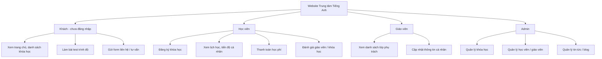
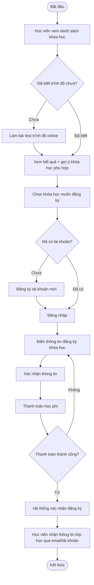
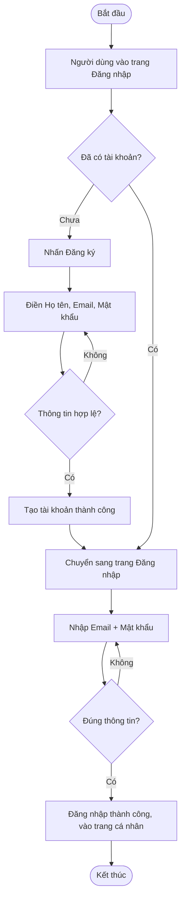
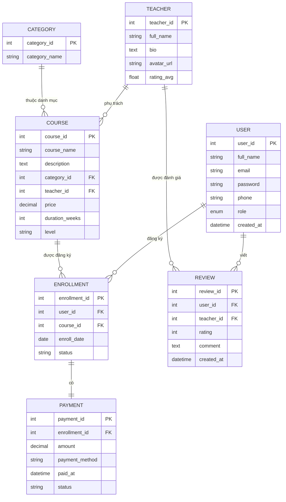

# 📐 SƠ ĐỒ THIẾT KẾ HỆ THỐNG

> Các sơ đồ dưới đây viết bằng cú pháp **Mermaid**. Cách xem/vẽ ra hình thật:
> - **Cách 1 (khuyến nghị):** Vào https://mermaid.live → dán code bên dưới vào ô trái → hình sẽ hiện ra bên phải → bấm "Download PNG/SVG" để lưu ảnh, sau đó chèn ảnh vào Notion/báo cáo.
> - **Cách 2:** Nếu Notion của bạn đã cập nhật mới, gõ `/mermaid` trong Notion rồi dán code thẳng vào — Notion sẽ tự render thành hình.
> - **Cách 3:** Dùng draw.io (diagrams.net) để vẽ lại tay theo mô tả logic bên dưới nếu muốn tùy chỉnh giao diện.

---

## 1. User Tree (Sơ đồ phân quyền người dùng)

---

## 2. Activity Diagram — Luồng "Đăng ký khóa học"

---

## 3. Activity Diagram — Luồng "Đăng nhập / Đăng ký tài khoản"

---

## 4. ERD — Sơ đồ quan hệ thực thể

### Bảng chi tiết từng entity (để đưa vào báo cáo)

**Bảng USER**

| STT | Tên cột | Kiểu dữ liệu | Mô tả |
|---|---|---|---|
| 1 | user_id | INT (PK) | Mã định danh người dùng |
| 2 | full_name | VARCHAR(100) | Họ tên |
| 3 | email | VARCHAR(100) | Email đăng nhập, duy nhất |
| 4 | password | VARCHAR(255) | Mật khẩu đã mã hóa |
| 5 | phone | VARCHAR(15) | Số điện thoại |
| 6 | role | ENUM('student','teacher','admin') | Vai trò người dùng |
| 7 | created_at | DATETIME | Ngày tạo tài khoản |

**Bảng COURSE**

| STT | Tên cột | Kiểu dữ liệu | Mô tả |
|---|---|---|---|
| 1 | course_id | INT (PK) | Mã khóa học |
| 2 | course_name | VARCHAR(150) | Tên khóa học |
| 3 | description | TEXT | Mô tả khóa học |
| 4 | category_id | INT (FK) | Danh mục khóa học |
| 5 | teacher_id | INT (FK) | Giáo viên phụ trách |
| 6 | price | DECIMAL(10,2) | Học phí |
| 7 | duration_weeks | INT | Thời lượng khóa học (tuần) |
| 8 | level | VARCHAR(50) | Trình độ (A1, B1, IELTS...) |

**Bảng ENROLLMENT**

| STT | Tên cột | Kiểu dữ liệu | Mô tả |
|---|---|---|---|
| 1 | enrollment_id | INT (PK) | Mã đăng ký |
| 2 | user_id | INT (FK) | Học viên đăng ký |
| 3 | course_id | INT (FK) | Khóa học được đăng ký |
| 4 | enroll_date | DATE | Ngày đăng ký |
| 5 | status | VARCHAR(30) | Trạng thái (chờ duyệt/đã xác nhận/hủy) |

*(Bảng TEACHER, CATEGORY, PAYMENT, REVIEW làm tương tự — dựa theo cột đã liệt kê trong sơ đồ ERD ở trên)*

### Ghi chú chuẩn hóa (Normalization)

- Tách riêng bảng `CATEGORY` khỏi `COURSE` để tránh lặp lại tên danh mục ở mỗi dòng khóa học (đạt 2NF)
- Tách riêng bảng `PAYMENT` khỏi `ENROLLMENT` vì 1 lượt đăng ký có thể có thông tin thanh toán thay đổi (trạng thái, ngày trả) mà không ảnh hưởng dữ liệu đăng ký gốc
- `TEACHER` tách riêng khỏi `COURSE` vì 1 giáo viên có thể dạy nhiều khóa học — tránh lặp thông tin giáo viên (đạt 3NF)
